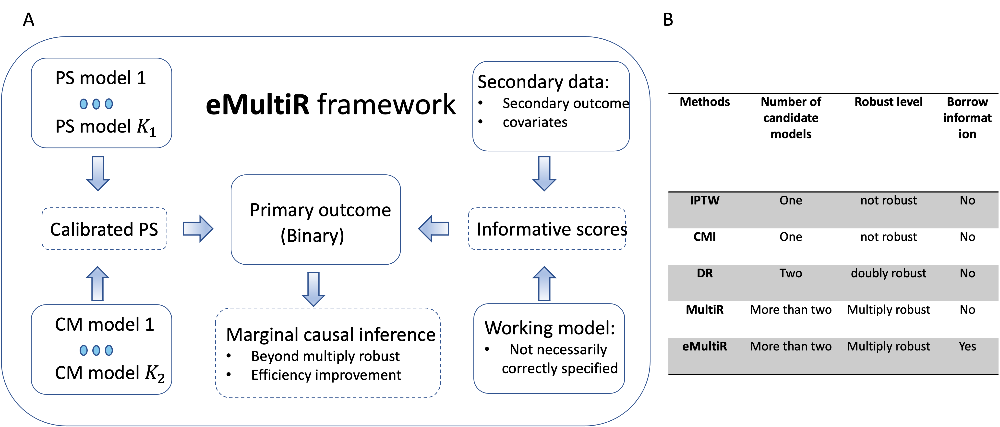

# eMultiR: Estimation of causal treatment effect on a binary outcome with multiple robustness and integrated information from secondary outcomes
  <!-- badges: start -->
  [](https://github.com/chencxxy28/eMultiR/actions)
  <!-- badges: end -->



**Background**: The assessment of causal treatment effect on the development and progression of certain disease is one of the key interests in clinical trials and biomedical studies. However, no one can pay on the success of inferring causal relationship when the treatment assignment is imbalanced and confounded by the other mechanisms. Specifically, when the treatment assignment is not randomized and the primary outcome is binary, the conventional logistic regression may not be valid to elucidate any causal inference, and exclusively capturing all confounders is extremely difficult and even impossible in large-scale observational studies. 

**eMultiR** is a multiply robust framework for estimation of causal effect under the setting with a binary outcome, where multiple propensity score models and conditional mean imputation models are used to ensure estimation robustness. Moreover, **eMultiR** reduces estimation variability by incorporating secondary outcomes that are highly correlated with the primary binary outcome. The resulting estimates are less sensitive to model mis-specification compared to that based on the existing state-of-the-art methods (e.g., doubly robust estimators).

# Installation

``` r
if (!require("devtools")) {
  install.packages("devtools")
}
devtools::install_github("chencxxy28/eMultiR")
```

# Vignettes

Please visit [Tutorial](https://chencxxy28.github.io/eMultiR/articles/NAME-OF-VIGNETTE.html)

# Relevant reference
[Information borrow](https://onlinelibrary.wiley.com/doi/abs/10.1002/sim.9252): Integration of information from the secondary outcome to enhance the estimation efficiency in the main analysis based on GLM.

[Multiply robust estimate](https://academic.oup.com/biomet/article-abstract/100/2/417/202879): The multiply robust estimate for the mean in the presence of missing data. 

